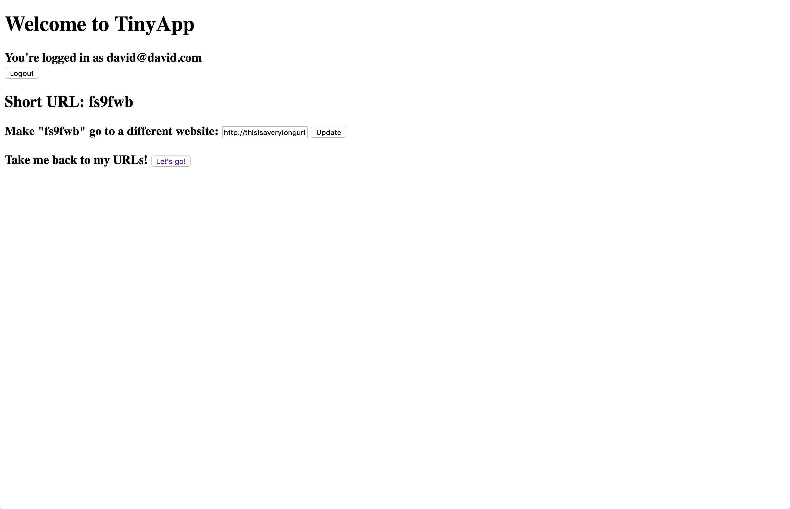
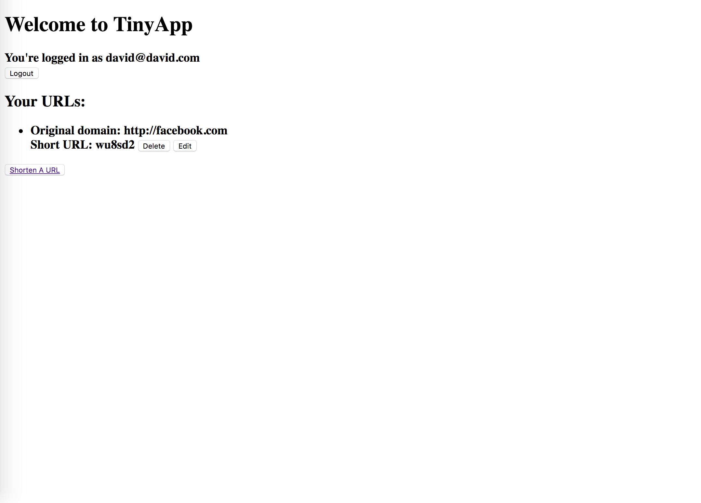

#TinyApp Project

Tinyapp is a full stack web app built with Node and Express that allows users to shorten URLs.

## Final Product:

;
;

## Dependencies:

* Node.js
* Express
* EJS
* bcrypt
* body-parser
* cookie-session

## Getting Started

1. Install all dependencies using NPM Install
2. Run the development server using the node express-server.js command
3. Register with an email address and password. 
4. Start shortening!
5. To visit your shortened urls, use /u/ and then paste in your shortened URL. 

Check out docs for screenshots and enjoy!